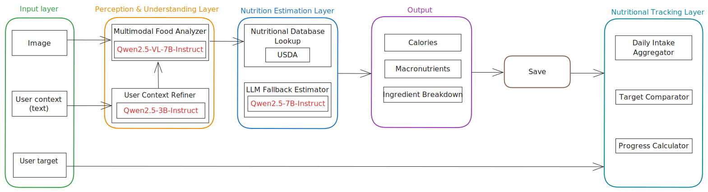
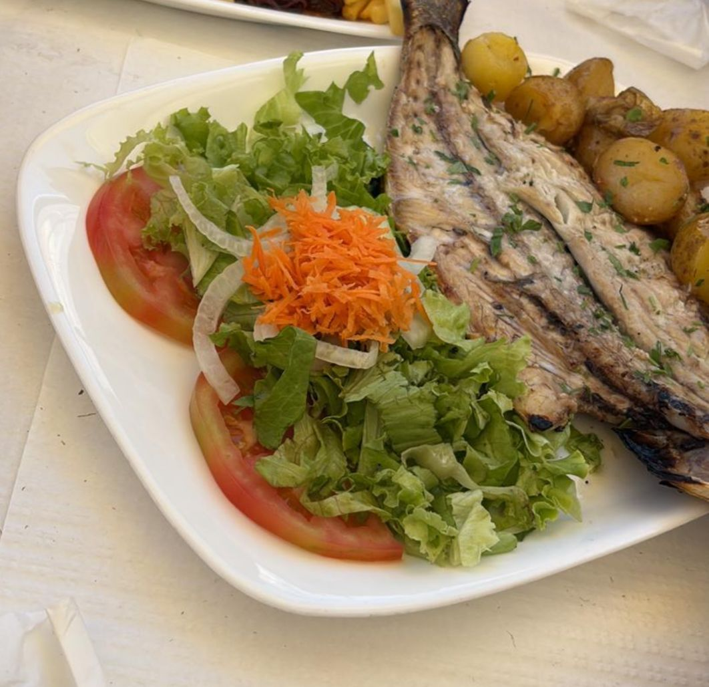
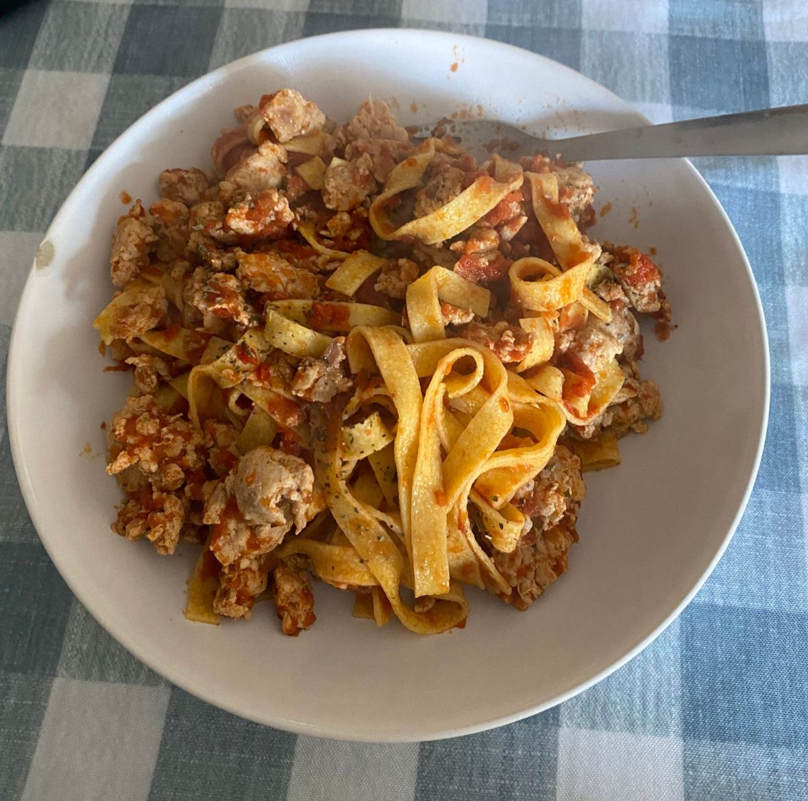

<table border="0">
  <tr>
    <td>
      
    </td>
    <td>
      <h1> CalorIA: Pipeline Nutricional Inteligente</h1>
    </td>
  </tr>
</table>

---


# Objetivo

El objetivo de este proyecto es desarrollar un sistema basado en Deep Learning capaz de estimar las calorías y macronutrientes de una comida a partir de una imagen, integrando de forma coherente información visual y textual proporcionada por el usuario. Para ello, se plantea el diseño de un pipeline multimodal que permita identificar los ingredientes presentes en el plato, inferir su contexto culinario y estimar cantidades realistas, combinando el uso de modelos de visión-lenguaje con técnicas de procesamiento de texto. Asimismo, el sistema busca apoyarse en bases de datos nutricionales y mecanismos de estimación cuando sea necesario, con el fin de obtener una aproximación fiable de los valores nutricionales, manteniendo una arquitectura modular que facilite su mejora y escalabilidad.

# Arquitectura del Pipeline

<p align="center">
  
</p>

*Diagrama detallado del flujo de datos desde la entrada multimodal hasta el resultado final.*


# Metodología

El sistema desarrollado sigue un enfoque modular basado en un pipeline multimodal que integra información visual y textual para estimar el contenido nutricional de una comida y compararlo con los objetivos del usuario.

En primer lugar, el sistema recibe como entrada una imagen de la comida, un texto opcional proporcionado por el usuario (para añadir contexto adicional) y los datos personales del usuario (como peso, altura, edad y nivel de actividad). A partir de estos últimos, se estiman las necesidades calóricas diarias mediante la ecuación de Mifflin-St Jeor.

A continuación, el texto introducido por el usuario es procesado mediante un modelo de lenguaje (Qwen2.5-3B-Instruct), cuyo objetivo es traducirlo al inglés y optimizarlo como contexto estructurado para el modelo multimodal. Este paso garantiza que la información adicional se integre de forma precisa sin introducir supuestos.

Posteriormente, la imagen junto con el contexto textual se introducen en el modelo de visión-lenguaje (Qwen2-VL-7B-Instruct), el cual actúa como un sistema experto capaz de identificar los alimentos presentes en el plato, estimar sus cantidades y contextualizar el tipo de preparación. Como salida, se genera un JSON estructurado que incluye los ingredientes, su peso estimado y si su detección es visual o inferida.

En la fase de estimación nutricional, el sistema consulta bases de datos externas (principalmente USDA). En caso de no encontrar coincidencias fiables, se emplea un modelo de lenguaje (Qwen2.5-7B-Instruct) como mecanismo de respaldo para estimar los valores nutricionales de los alimentos.

Los resultados obtenidos se almacenan en un sistema de persistencia basado en archivos JSON, organizados por fecha y hora, permitiendo el seguimiento del consumo diario del usuario.

Finalmente, el sistema agrega la información nutricional diaria y la compara con los objetivos definidos por el usuario, proporcionando una evaluación del progreso. Como extensión del sistema, se contempla la generación de recomendaciones o recetas orientadas a alcanzar dichos objetivos nutricionales.

# Uso

En el archivo `main.ipynb` se muestra un ejemplo de uso.

Primero se introducen los datos del usuario:

```Python
user = UserProfile(
    name           = "Usuario",
    sex            = "male",        # "male" | "female"
    age            = 25,
    weight_kg      = 75.0,
    height_cm      = 178.0,
    activity_level = 3,             # entrenos/semana (0-6)
    goal           = "maintenance",  # "loss" | "maintenance" | "gain"
    restrictions   = {                   
        "allergies":    [],               # e.g. ["gluten", "nuts"]
        "intolerances": [],               # e.g. ["lactose"]
        "dislikes":     [],               # e.g. ["liver", "anchovies"]
    }
)
```

Seguido de la imagen y un texto opcional del usuario:

<p align="center">
  

  
  "Boloñesa y lleva 125 gramos de pasta"
</p>


# 📸 Ejemplo de uso

<div style="display: flex; justify-content: space-between; gap: 20px;">

  <!-- BLOQUE 1 -->

  <div style="width: 48%; text-align: center;">
    

```
<br><br>

<table>
  <thead>
    <tr>
      <th>Ingrediente</th>
      <th>Gramos</th>
      <th>Fuente</th>
    </tr>
  </thead>
  <tbody>
    <tr><td>Grilled fish</td><td>200</td><td>Visible</td></tr>
    <tr><td>Lettuce</td><td>50</td><td>Visible</td></tr>
    <tr><td>Tomatoes</td><td>50</td><td>Visible</td></tr>
    <tr><td>Onions</td><td>20</td><td>Visible</td></tr>
    <tr><td>Carrots</td><td>10</td><td>Visible</td></tr>
    <tr><td>Potatoes</td><td>50</td><td>Visible</td></tr>
  </tbody>
</table>
```

  </div>

  <!-- BLOQUE 2 -->

  <div style="width: 48%; text-align: center;">
    

```
<br><br>

<table>
  <thead>
    <tr>
      <th>Ingrediente</th>
      <th>Gramos</th>
      <th>Fuente</th>
    </tr>
  </thead>
  <tbody>
    <tr><td>pasta</td><td>125</td><td>visible</td></tr>
    <tr><td>meat</td><td>100</td><td>visible</td></tr>
    <tr><td>tomato sauce</td><td>100</td><td>visible</td></tr>
  </tbody>
</table>
```

  </div>

</div>


"kcal": 399.0,
"protein_g": 44.0,
"fat_g": 27.8,
"carbs_g": 20.5,
"fiber_g": 3.1,
"sugar_g": 2.9,
"sodium_mg": 495.2


"kcal": 819.8,
"protein_g": 29.5,
"fat_g": 6.3,
"carbs_g": 89.0,
"fiber_g": 3.6,
"sugar_g": 8.5,
"sodium_mg": 93.2


Como resultado se obtiene una descripción de las características del plato


# Limitaciones

La estimación de cantidades a partir de la imagen es una estimación y depende de la calidad y la perspectiva de la imagen. Además, la detección de alimentos ocultos o poco visibles puede resultar imprecisa.
La cobertura de las bases de datos nutricionales no siempre es completa, requiriendo estimaciones adicionales. Por último, el coste computacional del sistema es elevado, lo que se traduce en tiempos de inferencia altos y limita su aplicabilidad en entornos en tiempo real.


# Futuros trabajos

El sistema desarrollado constituye una base sólida para el análisis nutricional multimodal, pero presenta diversas oportunidades de mejora y ampliación.
En primer lugar, se plantea optimizar el rendimiento del pipeline, reduciendo los tiempos de inferencia mediante técnicas de cuantización, uso de modelos más ligeros o estrategias de caché, lo que permitiría su integración en aplicaciones en tiempo real.

Asimismo, sería interesante mejorar la precisión en la estimación de cantidades, incorporando técnicas más avanzadas de visión por computador, como estimación de volumen o segmentación de alimentos, con el objetivo de reducir la dependencia de heurísticas y aproximaciones.

Otra línea de trabajo relevante consiste en ampliar y enriquecer las fuentes de datos nutricionales, integrando más bases de datos o desarrollando un sistema propio que permita mejorar la cobertura y fiabilidad de los alimentos detectados.

Desde el punto de vista del usuario, se propone el desarrollo de una interfaz interactiva (por ejemplo, mediante Streamlit) que permita subir imágenes, introducir contexto adicional y visualizar los resultados de forma intuitiva, incluyendo gráficos de progreso y recomendaciones personalizadas.

Finalmente, se contempla la posibilidad de evolucionar el sistema hacia un asistente nutricional inteligente, capaz de aprender de los hábitos del usuario y generar recomendaciones más avanzadas, como planificación de dietas o sugerencias de comidas adaptadas a objetivos específicos.


# Bibliografía

```bibtex
@misc{qwen2.5,
    title = {Qwen2.5: A Party of Foundation Models},
    url = {https://qwenlm.github.io/blog/qwen2.5/},
    author = {Qwen Team},
    month = {September},
    year = {2024}
}

@article{qwen2,
      title={Qwen2 Technical Report}, 
      author={An Yang and Baosong Yang and Binyuan Hui and Bo Zheng and Bowen Yu and Chang Zhou and Chengpeng Li and Chengyuan Li and Dayiheng Liu and Fei Huang and Guanting Dong and Haoran Wei and Huan Lin and Jialong Tang and Jialin Wang and Jian Yang and Jianhong Tu and Jianwei Zhang and Jianxin Ma and Jin Xu and Jingren Zhou and Jinze Bai and Jinzheng He and Junyang Lin and Kai Dang and Keming Lu and Keqin Chen and Kexin Yang and Mei Li and Mingfeng Xue and Na Ni and Pei Zhang and Peng Wang and Ru Peng and Rui Men and Ruize Gao and Runji Lin and Shijie Wang and Shuai Bai and Sinan Tan and Tianhang Zhu and Tianhao Li and Tianyu Liu and Wenbin Ge and Xiaodong Deng and Xiaohuan Zhou and Xingzhang Ren and Xinyu Zhang and Xipin Wei and Xuancheng Ren and Yang Fan and Yang Yao and Yichang Zhang and Yu Wan and Yunfei Chu and Yuqiong Liu and Zeyu Cui and Zhenru Zhang and Zhihao Fan},
      journal={arXiv preprint arXiv:2407.10671},
      year={2024}
}

@misc{qwen2.5-VL,
    title = {Qwen2.5-VL},
    url = {https://qwenlm.github.io/blog/qwen2.5-vl/},
    author = {Qwen Team},
    month = {January},
    year = {2025}
}

@article{Qwen2VL,
  title={Qwen2-VL: Enhancing Vision-Language Model's Perception of the World at Any Resolution},
  author={Wang, Peng and Bai, Shuai and Tan, Sinan and Wang, Shijie and Fan, Zhihao and Bai, Jinze and Chen, Keqin and Liu, Xuejing and Wang, Jialin and Ge, Wenbin and Fan, Yang and Dang, Kai and Du, Mengfei and Ren, Xuancheng and Men, Rui and Liu, Dayiheng and Zhou, Chang and Zhou, Jingren and Lin, Junyang},
  journal={arXiv preprint arXiv:2409.12191},
  year={2024}
}

@article{Qwen-VL,
  title={Qwen-VL: A Versatile Vision-Language Model for Understanding, Localization, Text Reading, and Beyond},
  author={Bai, Jinze and Bai, Shuai and Yang, Shusheng and Wang, Shijie and Tan, Sinan and Wang, Peng and Lin, Junyang and Zhou, Chang and Zhou, Jingren},
  journal={arXiv preprint arXiv:2308.12966},
  year={2023}
}


@misc{usda2024branded,
  author = {{U.S. Department of Agriculture, Agricultural Research Service}},
  title = {USDA Branded Food Products Database},
  year = {2024},
  url = {https://data.nal.usda.gov/dataset/fooddata-central},
  note = {Accessed: [Insert Date Here]}
}


@article{mifflin1990new,
  title={A new predictive equation for resting energy expenditure in healthy individuals},
  author={Mifflin, M. D. and St Jeor, S. T. and Hill, L. A. and Scott, B. J. and Daugherty, S. A. and Koh, Y. O.},
  journal={The American Journal of Clinical Nutrition},
  volume={51},
  number={2},
  pages={241--247},
  year={1990},
  publisher={Oxford University Press},
  doi={10.1093/ajcn/51.2.241}
}


```
